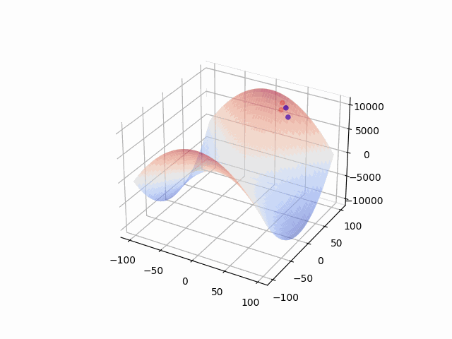

# Visualize Optimization Algorithms

This example provides a simple method to visualize optimization process on specific surface e.g., Positive Definite Case, Saddle Point ... etc.



## Environment Setup
We use python3.8, numpy 1.21.2, matplotlib 3.4.3 for this example

## Customize The Loss function Surface

```python
class Surface:
    def __init__(self):
        # define some surface attributes
    
    def compute_values(self, x, y):
        # the actual function, compute the value for Z-axis
        return x**2 + y**2
    
    def gradient(self, x, y):
        # compute the gradient for specific point on with 
        # respect to this surface
        dx = 2*x
        dy = 2*y
        return dx, dy
```

## Customize Optimization Algorithms

```python
class Optimizer
    def __init__(self):
        # define some optimizer related attributes, like:
        # momentum

    def update(self, surface, lr=0.05):
        # to compute next (x, y, z), which is based on the gradient of the surface and the surface function

        # implement the optimization logic here

        return x, y, z

```

## License
MIT License
