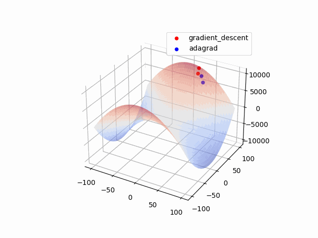
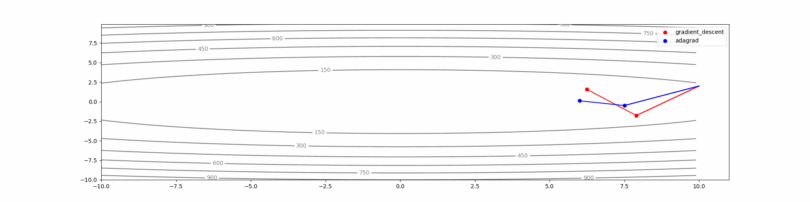

# Visualize Optimization Algorithms

This example provides a simple method to visualize optimization process on specific surface e.g., Positive Definite Case, Saddle Point ... etc.




## Environment Setup
We use python3.8, numpy 1.21.2, matplotlib 3.4.3 for this example

## Customize The Loss function Surface

```python
# in surface.py

class Surface:
    def __init__(self):
        # Define some surface attributes
    
    def compute_func(self, x, y):
        # Actual Function, compute the value for Z-axis
        return x**2 + y**2
    
    def compute_grad(self, x, y):
        # Compute the gradient with respect to the point on
        # this surface
        dx = 2*x
        dy = 2*y
        return dx, dy
```

## Customize Optimization Algorithms

```python
# in optim.py

class Optimizer
    def __init__(self, x, y, surface):
        # Define some optimizer related attributes, like:
        # momentum
       
        self.surface = surface
        
        # record each step 
        self.X = [x]
        self.Y = [y]
        self.Z = [surface.compute_func(x, y)]
	

    def update(self, lr=0.05):
        # Compute next point (x, y, z), which is based on the gradient of the surface 
        # and the surface function
        # Implement the optimization logic here
        
        dx, dy = self.surface.compute_grad(self.X[-1], self.Y[-1])
        
        ...
 
        return x, y, z
```
## Reference
- [Mark Chang's Blog](https://ckmarkoh.github.io/blog/categories/optimization-methods)

## License
MIT License
